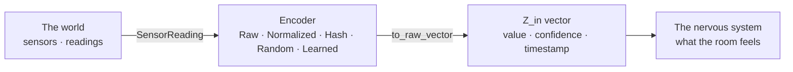

# plato-perception

[] [] []

Perception encoding for Z_in side of Dual-DB JEPA

<p align="center"></p>



---

## Quick Start

```bash
git clone https://github.com/SuperInstance/plato-perception
cd plato-perception
```

## About

Part of the [SuperInstance](https://github.com/SuperInstance) fleet ecosystem — a distributed cognitive agent orchestration platform built across ARM64 and x86_64 clusters.

### Related Fleet Repos

- [⏱️ tminus-dispatcher](https://github.com/SuperInstance/tminus-dispatcher) — Temporal heartbeat for agent coordination
- [🔌 tminus-client](https://github.com/SuperInstance/tminus-client) — Client SDK + CLI
- [🌉 fleet-bridge](https://github.com/SuperInstance/fleet-bridge) — A2A dual-transport communication
- [🎼 symphony-runtime](https://github.com/SuperInstance/symphony-runtime) — Cognitive orchestration grammar
- [🧠 composite-headspace](https://github.com/SuperInstance/composite-headspace) — Dual-shell parallel reasoning
- [📡 i2i-bottle-agent](https://github.com/SuperInstance/i2i-bottle-agent) — Inter-agent bottle protocol
- [🧮 constraint-tminus-bridge](https://github.com/SuperInstance/constraint-tminus-bridge) — Constraint networks for agent alignment
- [🎻 symphony-orchestrator](https://github.com/SuperInstance/symphony-orchestrator) — Full stack orchestrator

## License

MIT

---

*🦀 Part of the **SuperInstance Fleet** — The crab inherits the shell. The forge shapes the steel.*
